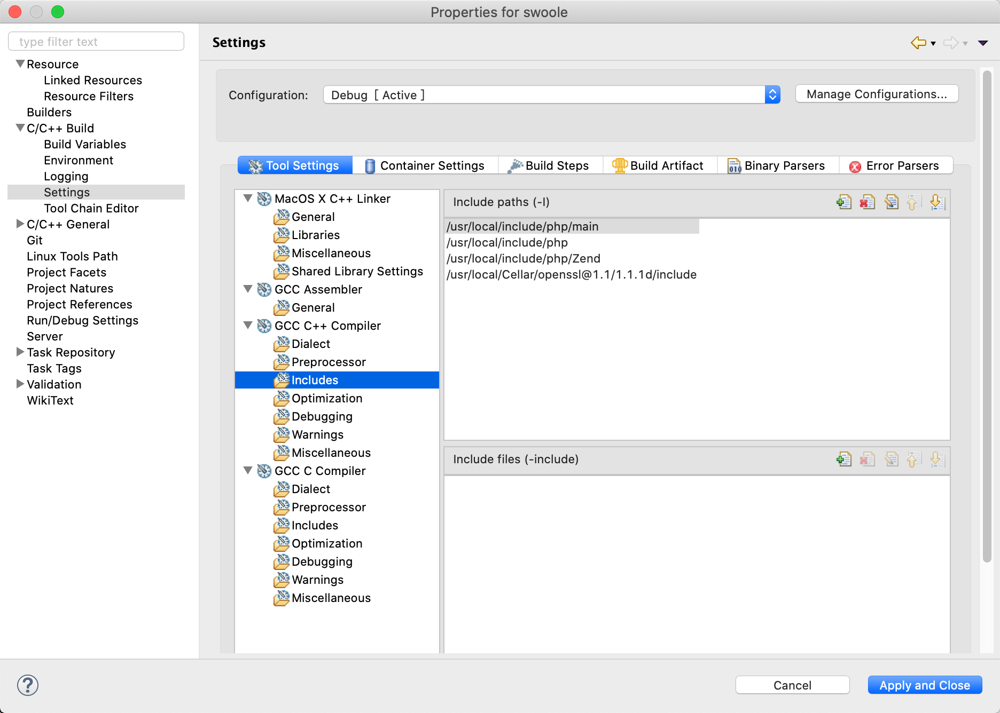
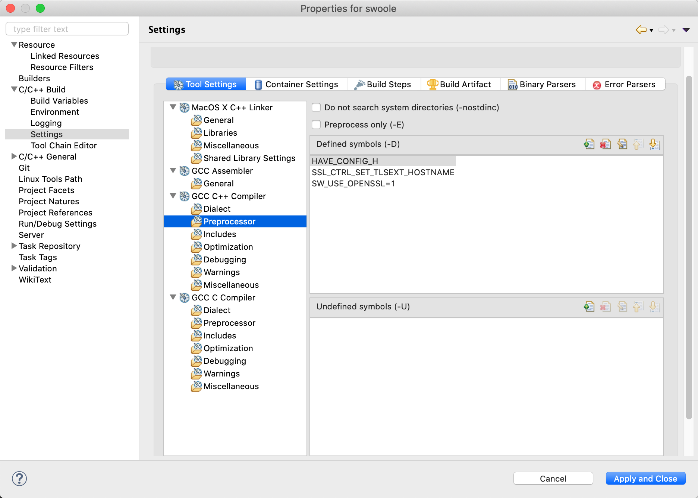

如何参与贡献 Swoole 开源项目
=====

技能需求
----
* `C++11`编程
* 了解`Linux`系统相关`API`知识，如`epoll`、`socket`、`fork`、`pthread`，具备`Unix`环境编程能力
* 了解`PHP` `ZendVM`的基本原理，了解`php-src`

安装软件
----
```php
sudo apt install php-dev gcc g++ cmake autoconf curl openssl
```

克隆项目
----
建议在`github`上`fork` `swoole-src` 到个人空间，然后`git clone`到本地

```shell
cd ~/workspace/
git@github.com:{your_name}/swoole-src.git
cd swoole-src
```

开发环境
----
* `Linux`环境，建议使用 `Ubuntu 18/20`，`Windows`环境可使用`WSL2`或`虚拟机`
* `C++11`编译器，建议使用`g++`
* `IDE`：请使用`Eclipse CDT`，不建议使用`VIM`和`Emacs`这样的本文编辑器
* 建议使用宽屏显示器，分辨率大于`1920x1080`

编码风格
-----
* 遵循`Google C++ Style`规范
* 请使用`clang-format` （`v9`或更高）工具格式化代码
* 单行字符宽度调整为`120`，原因是在现代大屏幕显示器上，`Unix`传统的`80`宽度太小了，只占用到了`50%`左右屏幕，在屏幕上会留下大量空白区域，利用率不足。调整到`120`宽度，在`Eclipse`等`IDE`工具中，左侧是工程视图、右侧是类/函数结构视图，中间区域是代码编辑区，可以最大化利用显示器所有区域
* 缩进从`2`空格调整为`4`空格，原因是`2`空格，辨识度较低，带来了不必要的心智负担，调整到`4`空格，会更加清晰


#### 新建工程
在`Eclipse`中创建`C++`工程，目录使用克隆好的`swoole-src`

#### 配置 IDE
配置工程的`include`路径，注意需要同时配置`C`和`C++`相关，将`php`头文件目录设置到`include`路径中。例如：

* `/usr/local/include/php`
* `/usr/local/include/php/main`
* `/usr/local/include/php/TSRM`
* `/usr/local/include/php/Zend`




配置工程的预定义宏，加入`HAVE_CONFIG_H`



#### 构建工程
```shell
cd ~/workspace/swoole-src
phpize
./configure
make -j 8
suod make install
```

#### 加载扩展
修改`php.ini`在末尾加入`swoole.so`

项目开发
---
修改`swoole-src`下的`.h`和`.cc`源文件，重新编译安装，编写测试脚本，验证是否生效。

#### 目录结构

* `src/` : 与`php`无关的内核模块源文件
* `include/` : 头文件
* `core-tests` : 内核测试文件，基于`googletest`
* `tests` : `PHP`测试文件
* `examples` : 示例文件
* `swoole_*.cc` : `PHP`扩展相关源文件
